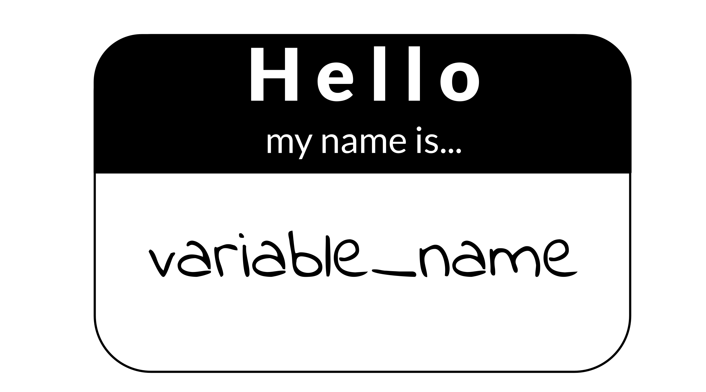

```{r, include = FALSE}
leanbuild::set_knitr_image_path()
```

# Writing durable code

## Learning Objectives

```{r, fig.align='center', echo = FALSE, fig.alt= "This chapter will demonstrate how to: Convert common code pitfalls into more readable and durable alternatives. Write code that is more readable and durable. Write code that is more useable by others.  Understand the importance of following a code style."}
leanbuild::include_slide("https://docs.google.com/presentation/d/1LMurysUhCjZb7DVF6KS9QmJ5NBjwWVjRn40MS9f2noE/edit#slide=id.gf8f405fdab_0_9")
```

## General principles

#### Work on your code iteratively


Getting your code to work the first time is the first step, but don't stop there!
Just like in writing a manuscript you wouldn't consider your first draft a final draft, your polishing code works best in an iterative manner. Although you may need to set it aside for the day to give your brain a rest, return to your code later with fresh eyes and try to look for ways to improve upon it!

#### Prioritize readability over cleverness


Some cleverness in code can be helpful, too much can make it difficult for others to understand. If cleverness comprises the readability of your code, it probably is not worth it. Clever but unreadable code won't be re-used or trusted by others (including perhaps your future self!).

What does readable code look like? @Orosz2019 has some thoughts on writing readable code:

> **Readable code starts with code that you find easy to read.** When you finish coding, take a break to clear your mind. Then try to re-read the code, putting yourself in the mindset that you know nothing about the changes and why you made them.
>
> Can you follow along with your code? Do the variables and method names help understand what they do? Are there comments at places where just the code is not enough? Is the style of the code consistent across the changes?
>
> Think about how you could make the code more readable. Perhaps you see some functions that do too many things and are too long. Perhaps you find that renaming a variable would make its purpose clearer. Make changes until you feel like the code is as expressive, concise, and pretty as it can be.

> **The real test of readable code is others reading it.** So get feedback from others, via code reviews. Ask people to share feedback on how clear the code is. Encourage people to ask questions if something does not make sense. Code reviews - especially thorough code reviews - are the best way to get feedback on how good and readable your code is.
>
> Readable code will attract little to no clarifying questions, and reviewers won't misunderstand it. So pay careful attention to the cases when you realize someone misunderstood the intent of what you wrote or asked a clarifying question. Every question or misunderstanding hints to opportunities to make the code more readable.
>
> A good way to get more feedback on the clarity of your code is to ask for feedback from someone, who is not an expert on the codebase you are working on. Ask specifically for feedback on how easy to read your code is. Because this developer is not an expert on the codebase, they'll focus on how much they can follow your code. Most of the comments they make will be about your code's readability.

We'll talk a bit more about code review in a upcoming chapter!

**More reading:**

- [Readable Code](https://blog.pragmaticengineer.com/readable-code/) by @Orosz2019.  
- [Write clean R code](https://appsilon.com/write-clean-r-code/) by @Dubel2021.
- [Python Clean Code: 6 Best Practices to Make Your Python Functions More Readable](https://towardsdatascience.com/python-clean-code-6-best-practices-to-make-your-python-functions-more-readable-7ea4c6171d60) by @Tran2021.

#### DRY up your code


[DRY](https://web.archive.org/web/20131204221336/http://programmer.97things.oreilly.com/wiki/index.php/Don't_Repeat_Yourself) is an acronym: "Don't repeat yourself" [@Smith2013].

> "I hate code, and I want as little of it as possible in our product."

– @Diederich2012

If you find yourself writing something more than once, you might want to write a function, or store something as a variable. The added benefit of writing a function is you might be able to borrow it in another project. DRY code is easier to fix and maintain because if it breaks, its easier to fix something in one place, then in 10 places.  

DRY code is easier on the reviewer because they don't have to review the same thing twice, but also because they don't have to review the same thing twice. ;)
DRYing code is something that takes some iterative passes and edits through your code, but in the end DRY code saves you and your collaborators time and can be something you reuse again in a future project!

Here's an slightly modified example from @Bernardo2021 for what DRY vs non-DRY code might look like:

```
paste('Hello','John', 'welcome to this course')
paste('Hello','Susan', 'welcome to this course')
paste('Hello','Matt', 'welcome to this course')
paste('Hello','Anne', 'welcome to this course')
paste('Hello','Joe', 'welcome to this course')
paste('Hello','Tyson', 'welcome to this course')
paste('Hello','Julia', 'welcome to this course')
paste('Hello','Cathy', 'welcome to this course')
```

Could be functional-ized and rewritten as:

```
GreetStudent <- function(name) {
 greeting <- paste('Hello', name, 'welcome to this course')
 return(greeting)
}

class_names <- c('John', 'Susan', 'Matt' ,'Anne', 'Joe', 'Tyson', 'Julia', 'Cathy')

lapply(class_names, GreetStudent)
```

Now, if you wanted to edit the greeting, you'd only need to edit it in the function, instead of in each instance.

**More reading:**

- [Keep your code dry](https://www.drycode.io/) by @DRY.  
- [DRY Programming Practices](https://metova.com/dry-programming-practices/) by @Klinefelter2016.

#### Don't be afraid to delete and refresh a lot  


Don’t be afraid to delete it all and re-run (multiple times). This includes refreshing your kernel/session in your IDE.

In essence, this is the data science version of "Have you tried turning it off and then on again?" Some bugs in your code exist or are not realized because old objects and libraries have overstayed their welcome in your environment.

```{r, fig.align='center', echo = FALSE, fig.alt= "To refresh your kernel in python jupyter lab, go to Kernel then choose one of the Restart Kernel options. You can also use the keyboard shortcut of Escape and pressing 0 twice.  In RStudio, go to the dropdown arrow next to Run and choose Restart R and Clear Output. Or you can press the broom, OR you can use the keyboard shortcut of Ctrl and shift and F10 (For Mac) or Cmd and shift and F10 ( for Windows)."}
leanbuild::include_slide("https://docs.google.com/presentation/d/1LMurysUhCjZb7DVF6KS9QmJ5NBjwWVjRn40MS9f2noE/edit#slide=id.g102dc56db08_49_212")
```

<details> <summary> *Why do you need to refresh your kernel/session?*  </summary>

As a quick example of why refreshing your kernel/session, let's suppose you are troubleshooting something that centers around an object named `some_obj` but then you rename this object to `iris_df`. When you rename this object you may need to update this other places in the code. If you don't refresh your environment while working on your code, `some_obj` will still be in your environment. This will make it more difficult for you to find where else the code needs to be updated.

Refreshing your kernel/session goes beyond objects defined in your environment, and also can affect packages and dependencies loaded or all kinds of other things attached to your kernel/session.

As a quick experiment, try this in your Python or R environment:

The `dir()` and `ls()` functions list your defined variables in your Python and R environments respectively.

**In Python:**
```
some_obj=[]
dir()
```
Now refresh your Kernel and re-run `dir()`
```
dir()
```
You should see you no longer have `some_obj` listed as being defined in your environment.

**In R**
```
some_obj <- c()
ls()
```
Now refresh your ession and re-run `ls()`
```
ls()
```
You should see you no longer have `some_obj` listed as being defined in your environment.

</details>

Keeping around old code and objects is generally more of a hindrance than a time saver. Sometimes it can be easy to get very attached to a chunk of code that took you a long time to troubleshoot but there are three reasons you don't need to stress about deleting it:  

1) You might write better code on the second try (or third or n'th).  
2) Keeping around old code makes it harder for you to write and troubleshoot new better code -- it's easier to confuse yourself. Sometimes a fresh start can be what you need.  
3) With version control you can always return to that old code! (We'll dive more into version control later on, but you've started the process by [uploading your code to GitHub in chapter 4](https://jhudatascience.org/Reproducibility_in_Cancer_Informatics/why-git-and-github.html)!)  

This means you should not comment out old code. Just delete it! No code is so precious that you need to keep it commented out (particularly if you are using version control and you can retrieve it in other ways should you need it).

Related to this, if you want to be certain that your code is reproducible, it's worth deleting all your output, and re-running everything with a fresh session. The first step to knowing if your analysis is reproducible is seeing if you can repeat it yourself!


#### Use code comments effectively  


Good code comments are a part of writing good, readable code! Your code is more likely to stand the test of time for longer if others, including yourself in the future, can see what’s happening enough to trust it themselves. This will encourage others to use your code and help you maintain it!

'Current You' who is writing your code may know what is happening but 'Future You' will have no idea what 'Current You' was thinking [@Spielman]:

> 'Future You' comes into existence about one second after you write code, and has no idea what on earth Past You was thinking. Help out 'Future You' by adding lots of comments! 'Future You' next week thinks Today You is an idiot, and the only way you can convince 'Future You' that Today You is reasonably competent is by adding comments in your code explaining why Today You is actually not so bad.

Your code and your understanding of it will fade soon after you write it, leaving your hard work to deprecate. Code that works is a start, but **readable** AND working code is best!

Comments can help clarify at points where your code might need further explanation. The act of writing them can also help you think out your thought process and perhaps identify a better solution to the odd parts of your code.

(From @Savonen2021)

**More reading:**   

- [Creating clarifying code comments](https://jhudatascience.org/Documentation_and_Usability/creating-clarifying-code-comments.html#creating-clarifying-code-comments)
- [Best Practices for Writing Code Comments](https://stackoverflow.blog/2021/07/05/best-practices-for-writing-code-comments/) by @Spertus2021.
- [What Makes a Good Code Comment?](https://itnext.io/what-makes-a-good-code-comment-5267debd2c24) by @Cronin2019.  
- [The Value of Code Documentation](https://www.olioapps.com/blog/the-value-of-code-documentation/) by @Meza2018.  
- [Some internet wisdom on R documentation](http://alyssafrazee.com/2014/04/20/rdocs.html) by @Frazee2014.  
- [How to Comment Your Code Like a Pro: Best Practices and Good Habits](https://www.elegantthemes.com/blog/wordpress/how-to-comment-your-code-like-a-pro-best-practices-and-good-habits) by @Keeton2019.  

#### Use informative variable names


Try to avoid using variable names that have no meaning like `tmp` or `x`, or `i`. Meaningful variable names make your code more readable! Additionally, variable names that are longer than one letter are much easier to search and replace if needed. One letter variables are hard to replace and hard to read.

> 1 Write intention-revealing names.  
> 2 Use consistent notation for naming convention.  
> 3 Use standard terms.  
> 4 Do not number a variable name.  
> 5 When you find another way to name variable, refactor as fast as possible.  

[@Hobert2018]

**More reading:**  

- [R for Epidemiology - Coding best Practices](https://www.r4epi.com/coding-best-practices.html#object-variable-names) by @Cannell2021.
- [Data Scientists: Your Variable Names Are Awful. Here’s How to Fix Them](https://towardsdatascience.com/data-scientists-your-variable-names-are-awful-heres-how-to-fix-them-89053d2855be) by @Koehrsen2019.  
- [Writing Variable — Informative, Descriptive & Elegant](https://medium.datadriveninvestor.com/writing-variable-informative-descriptive-elegant-1dd6f3f15db3) by @Hobert2018.   

#### 7. Follow a code style


Just like when writing doesN"t FoLLOW conv3nTi0Ns OR_sPAcinng 0r sp3llinG, it can be distracting, the same goes for code. Your code may even work all the same, just like you understood what I wrote in that last sentence, but a lack of consistent style can make require more brain power from your readers for them to understand. For reproducibility purposes, readability is important! The easier you can make it on your readers, the more likely they will be able to understand and reproduce the results.

There are different style guides out there that people adhere to. It doesn't matter so much which one you choose, so much that you pick one and stick to it for a particular project.  

_Python style guides_:

- [PEP8 style guide](https://www.python.org/dev/peps/pep-0008/) @PEP8.
- [Google Python style guide](https://google.github.io/styleguide/pyguide.html) @GooglePython.

_R style guides_:

- [Hadley Wickham's Style guide](http://adv-r.had.co.nz/Style.html) @Wickham.
- [Google R style guide](https://google.github.io/styleguide/Rguide.html) @GoogleR.

Although writing code following a style as you are writing is a good practice, we're all human and that can be tricky to do, so we recommend using an automatic styler on your code to fix up your code for you.
For Python code, you can use [python black](https://black.readthedocs.io/en/stable/) and for R, [styler](https://www.tidyverse.org/blog/2017/12/styler-1.0.0/).

#### Organize the structure of your code


Readable code should follow an organized structure. Just like how outlines help the structure of manuscript writing, outlines can also help the organization of code writing.

A tentative outline for a notebook might look like this:  

1) A description of the purpose of the code (in Markdown).  
2) Import the libraries you will need (including sourcing any custom functions).  
3) List any hard-coded variables.  
4) Import data.  
5) Do any data cleaning needed.   
6) The main thing you need to do.  
7) Print out session info.  

Note that if your notebook gets too long, you may want to separate out things in their own scripts. Additionally, it's good practice to keep custom functions in their own file and import them. This allows you to use them elsewhere and also keeps the main part of the analysis cleaner.

#### Set the seed if your analysis has randomness involved


If any randomness is involved in your analysis, you will want to set the seed in order for your results to be reproducible.

In brief, computers don't actually create numbers randomly they create [numbers pseudorandomly](https://en.wikipedia.org/wiki/Pseudorandom_number_generator). But if you want your results to be reproducible, you should give your computer a seed by which to create random numbers. This will allow anyone who re-runs your analysis to have a positive control and eliminate randomness as a reason the results were not reproducible.

<details> <summary>**For more on how setting the seed works -- a quick experiment**</summary>
To illustrate how seeds work, run we'll run a quick experiment with setting the seed here:

First let's set a seed (it doesn't matter what number we use, just that we pick a number), so let's use `1234` and then create a "random" number.

```{r}
# Set the seed:
set.seed(1234)

# Now create a random number again
runif(1)
```

Now if we try a different seed, we will get a different "random" number.

```{r}
# Set a different seed:
set.seed(4321)

# Now create a random number again
runif(1)
```

But, if we return to the original seed we used, `1234`, we will get the original "random" number we got.  

```{r}
# Set this back to the original seed
set.seed(1234)

# Now we'll get the same "random" number we got when we set the seed to 1234 previously
runif(1)
```

</details>


**More reading:**  

- [Set seed](https://r-coder.com/set-seed-r/) by @Soage2020.
- [Generating random numbers](http://www.cookbook-r.com/Numbers/Generating_random_numbers/) by @Chang2021.

#### To review general principles:

```{r, fig.align='center', echo = FALSE, fig.alt= "General principles of writing reproducible code. Work on your code iteratively. Prioritize readability over cleverness. DRY up your code. Don't be afraid to delete and refresh. Use code comments effectively. Use informative variable names. Follow a code style."}
leanbuild::include_slide("https://docs.google.com/presentation/d/1LMurysUhCjZb7DVF6KS9QmJ5NBjwWVjRn40MS9f2noE/edit#slide=id.gfc9e5f916a_0_89")
```

## More reading on best coding practices

There's so many opinions and strategies on best practices for code. And although a lot of these principles are generally applicable, not _all_ of it is one size fits all. Some code practices are context-specific so sometimes you may need to pick and choose what works for you, your team, and your particular project.

#### Python specific:

- [Reproducible Programming for Biologists Who Code Part 2: Should Dos](https://autobencoder.com/2020-06-30-shoulddo/) by @Heil2020b.
- [15 common coding mistakes data scientist make in Python (and how to fix them)](https://towardsdatascience.com/15-common-coding-mistakes-data-scientist-make-in-python-and-how-to-fix-them-7760467498af) by @Csendes2020.
- [Data Science in Production — Advanced Python Best Practices](https://medium.com/bcggamma/data-science-python-best-practices-fdb16fdedf82) by @Kostyuk2020.
- [6 Mistakes Every Python Beginner Should Avoid While Coding](https://towardsdatascience.com/6-mistakes-every-python-beginner-should-avoid-while-coding-e57e14917942) by @Saxena2021.

#### R specific:

- [Data Carpentry's: Best Practices for Writing R Code](https://swcarpentry.github.io/r-novice-inflammation/06-best-practices-R/) by @DataCarpentry2021b.
- [R Programming for Research: Reproducible Research](https://geanders.github.io/RProgrammingForResearch/reproducible-research-1.html) by @Good2021.
- [R for Epidemiology: Coding best practices](https://www.r4epi.com/coding-best-practices.html) by @Cannell2021.
- [Best practices for R Programming](https://towardsdatascience.com/best-practices-for-r-programming-ec0754010b5a) by @Bernardo2021.

## Get the exercise project files (or continue with the files you used in the previous chapter)

<details> <summary>**Get the Python project example files**</summary>
[Click this link to download](https://raw.githubusercontent.com/jhudsl/Reproducibility_in_Cancer_Informatics/main/chapter-zips/python-heatmap-chapt-7.zip).

```{bash, include = FALSE}
mkdir -p chapter-zips
wget -O chapter-zips/python-heatmap-chapt-7.zip https://raw.githubusercontent.com/jhudsl/Reproducibility_in_Cancer_Informatics/main/chapter-zips/python-heatmap-chapt-7.zip
```

Now double click your chapter zip file to unzip. For Windows you may have to [follow these instructions](https://support.microsoft.com/en-us/windows/zip-and-unzip-files-f6dde0a7-0fec-8294-e1d3-703ed85e7ebc)).

```{bash, include = FALSE}
unzip -o chapter-zips/python-heatmap-chapt-7.zip -d chapter-zips/
```
</details>

<details> <summary>**Get the R project example files**</summary>
[Click this link to download](https://raw.githubusercontent.com/jhudsl/Reproducibility_in_Cancer_Informatics/main/chapter-zips/r-heatmap-chapt-7.zip).

```{bash, include = FALSE}
mkdir -p chapter-zips
wget -O chapter-zips/r-heatmap-chapt-7.zip https://raw.githubusercontent.com/jhudsl/Reproducibility_in_Cancer_Informatics/main/chapter-zips/r-heatmap-chapt-7.zip
```

Now double click your chapter zip file to unzip. For Windows you may have to [follow these instructions](https://support.microsoft.com/en-us/windows/zip-and-unzip-files-f6dde0a7-0fec-8294-e1d3-703ed85e7ebc)).

```{bash, include = FALSE}
unzip -o chapter-zips/r-heatmap-chapt-7.zip -d chapter-zips/
```
</details>

## Exercise 1: Make code more durable!

### Organize the big picture of the code
Before diving in line-by-line it can be helpful to make a code-outline of sorts.

What are the main steps you need to accomplish in this notebook? What are the starting and ending points for this particular notebook?

For example, for this `make-heatmap` notebook we want to:  

1) Set up analysis folders and declare file names.  
2) Install the libraries we need.  
3) Import the gene expression data and metadata.  
4) Filter down the gene expression data to genes of interest -- in this instance the most variant ones.   
5) Clean the metadata.   
6) Create an annotated heatmap.   
7) Save the heatmap to a PNG.   
8) Print out the session info!  

<details> <summary>**Python version of the exercise**</summary>

**The exercise: Polishing code**  

1. Start up JuptyerLab with running `jupyter lab` from your command line.
2. Activate your conda environment using `conda activate reproducible-python`.
3. Open up your notebook you made in the previous chapter `make-heatmap.ipynb`
4. Work on organizing the code chunks and adding documentation to reflect the steps we've laid out in the [previous section](#organize-the-big-picture-of-the-code), you may want to work on this iteratively as we dive into the code.
5. As you clean up the code, you should run and re-run chunks to see if they work as you expect. You will also want to refresh your environment to help you develop the code (sometimes older objectives stuck in your environment can inhibit your ability to troubleshoot). In Juptyer, you refresh your environment by using the `refresh` icon in the toolbar or by going to `Restart Kernel`.

***

**Set the seed**

_Rationale:_
The clustering in the analysis involves some randomness. We need to set the seed!

_Before:_  
Nothing! We didn't set the seed before!

_After:_
You can pick any number; doesn't have to be 1234.
```
random.seed(1234)
```

**Use a relative file path**

_Rationale:_  
Absolute file paths only work for the original writer of the code and no one else. But if we make the [file path relative](https://www.educative.io/edpresso/absolute-vs-relative-path) to the project set up, then it will work for whomever has the project repository [@Mustafeez2021].

Additionally, we can set up our file path names using [f-Strings](https://realpython.com/python-f-strings/#f-strings-a-new-and-improved-way-to-format-strings-in-python) so that we only need to change the project ID and the rest will be ready for a new dataset [@Python2021]!

Although this requires more lines of code, this set up is much more flexible and ready for others to use.

_Before:_  
```
df1=pd.read_csv('~/a/file/path/only/I/have/SRP070849.tsv', sep='\t')
mdf=pd.read_csv('~/a/file/path/only/I/have/SRP070849_metadata.tsv', sep='\t')
```

_After:_  
```
# Declare project ID
id = "SRP070849"

# Define the file path to the data directory
data_dir = Path(f"data/{id}")

# Declare the file path to the gene expression matrix file
data_file = data_dir.joinpath(f"{id}.tsv")

# Declare the file path to the metadata file
# inside the directory saved as `data_dir`
metadata_file = data_dir.joinpath(f"metadata_{id}.tsv")

# Read in metadata TSV file
metadata = pd.read_csv(metadata_file, sep="\t")

# Read in data TSV file
expression_df = pd.read_csv(data_file, sep="\t")
```

_Related readings:_

- [f-strings in Python](https://www.geeksforgeeks.org/formatted-string-literals-f-strings-python/) by @Geeksforgeeks2018.
- [f-Strings: A New and Improved Way to Format Strings in Python](https://realpython.com/python-f-strings/#f-strings-a-new-and-improved-way-to-format-strings-in-python) by @Python2021.
- [Relative vs absolute file paths](https://www.educative.io/edpresso/absolute-vs-relative-path) by @Mustafeez2021.
- [About join path](https://www.programcreek.com/python/example/114070/pathlib.Path.joinpath) by @Programcreek2021.

**Avoid using mystery numbers**

_Rationale:_  
Avoid using numbers that don't have context around them in the code. Include the calculations for the number, or if it needs to be hard-coded, explain the rationale for that number in the comments. Additionally, using variable and column names that tell you what is happening, helps clarify what the number represents.

_Before:_   
```
df1['calc'] =df1.var(axis = 1, skipna = True)
df2=df1[df1.calc >float(10)]
```

_After:_  
```
# Calculate the variance for each gene
expression_df["variance"] = expression_df.var(axis=1, skipna=True)

# Find the upper quartile for these data
upper_quartile = expression_df["variance"].quantile([0.90]).values

# Filter the data choosing only genes whose variances are in the upper quartile
df_by_var = expression_df[expression_df.variance > float(upper_quartile)]
```

_Related readings:_  
- [Stop Using Magic Numbers and Variables in Your Code](https://betterprogramming.pub/stop-using-magic-numbers-and-variables-in-your-code-4e86f008b84c) by @Aaberge2021.


**Add checks**

_Rationale:_  
Just because your script ran without an error that stopped the script doesn't mean it is accurate and error free. Silent errors are the most tricky to solve, because you often won't know that they happened!

A very common error is data that is in the wrong order. In this example we have two data frames that contain information about the same samples. But in the original script, we don't ever check that the samples are in the same order in the metadata and the gene expression matrix! This is a really easy way to get incorrect results!

_Before:_   
Nothing, we didn't check for this before.

_After:_  
```
print(metadata["refinebio_accession_code"].tolist() == expression_df.columns.tolist())
```

Continue to try to apply the general advice we gave about code to your notebook!
Then, when you are ready, take a look at what our ["final" version](https://github.com/jhudsl/reproducible-python-example/blob/main/make_heatmap.ipynb) looks like in the [example Python repository](https://github.com/jhudsl/reproducible-python-example). (_Final_ here is in quotes because we may continue to make improvements to this notebook too -- remember what we said about iterative?)

</details>

<details> <summary>**R version of the exercise**</summary>

**About the tidyverse:**.  

Before we dive into the exercise, a word about the tidyverse. The tidyverse is a highly useful set of packages for creating readable and reproducible data science workflows in R. In general, we will opt for tidyverse approaches in this course, and strongly encourage you to familiarize yourself with the tidyverse if you have not. We will point out some instances where tidyverse functions can help you DRY up your code as well as make it more readable!

_More reading on the tidyverse:_  

- [Tidyverse Skills for Data Science](http://jhudatascience.org/tidyversecourse/intro.html) by @Wright2021.
- [A Beginner’s Guide to Tidyverse]( https://www.analyticsvidhya.com/blog/2019/05/beginner-guide-tidyverse-most-powerful-collection-r-packages-data-science/) by @Vidhya2019.
- [Introduction to tidyverse](https://alexslemonade.github.io/training-modules/intro-to-R-tidyverse/03-intro_to_tidyverse.nb.html) by @Shapiro2021.

**The exercise: Polishing code**  

1. Open up RStudio.
2. Open up the notebook you created in the previous chapter.  
3. Now we'll work on applying the principles from this chapter to the code. We'll cover some of the points here, but then we encourage you to dig into the fully transformed notebook we will link at the end of this section.
4. Work on organizing the code chunks and adding documentation to reflect the steps we've laid out in the [previous section](#organize-the-big-picture-of-the-code), you may want to work on this iteratively as we dive into the code.
5. As you clean up the code, you should run and re-run chunks to see if they work as you expect. You will also want to refresh your environment to help you develop the code (sometimes older objectives stuck in your environment can inhibit your ability to troubleshoot). In RStudio, you refresh your environment by going to the `Run` menu and using `Restart R and refresh clear output`.

***

**Set the seed**

_Rationale:_
The clustering in the analysis involves some randomness. We need to set the seed!

_Before:_  
Nothing! We didn't set the seed before!

_After:_
You can pick any number; doesn't have to be 1234.
```
set.seed(1234)
```

**Get rid of setwd**

_Rationale:_  
`setwd()` almost never work for anyone besides the one person who wrote it. And in a few days/weeks it may not work for them either.  

_Before:_  
```
setwd("Super specific/filepath/that/noone/else/has/")
```
_After:_  
Now that we are working from a notebook, we know that the default [current directory is wherever the notebook is placed](https://bookdown.org/yihui/rmarkdown-cookbook/working-directory.html) [@Xie2020].

_Related readings:_

- [Jenny Bryan will light your computer on fire if you use setwd() in a script](https://www.tidyverse.org/blog/2017/12/workflow-vs-script/) [@Bryan2017].

**Give the variables more informative names**

_Rationale:_  
`xx` doesn't tell us what is in the data here. Also by using the `readr::read_tsv()` from tidyverse we'll get a cleaner, faster read and won't have to specify `sep` argument. Note we are also fixing some spacing and using `<-` so that we can stick to readability conventions.

You'll notice later

_Before:_  
```
xx=read.csv("metadata_SRP070849.tsv", sep = "\t")
```
_After:_   
```
metadata <- readr::read_tsv("metadata_SRP070849.tsv")
```

_Related readings:_

- [`readr::read_tsv()` documentation](https://readr.tidyverse.org/reference/read_delim.html) by @Tidyverse2021.

**DRYing up data frame manipulations**

_Rationale:_  
This chunk of code can be very tricky to understand what it is doing.
What is happening with df1 and df2? What's being filtered out? etc.
Code comments would certainly help understanding, but even better, we can DRY this code up and

_Before:_  
It may be difficult to tell from looking at the before code because there are no comments and it's a bit tricky to read, but the goal of this is to:  

1) Calculate variances for each row (each row is a gene).
2) Filter the original gene expression matrix to only genes have a bigger variance (here we use arbitrarily 10 as a filter cutoff).

```
df=read.csv("SRP070849.tsv", sep="\t")
sums=matrix(nrow = nrow(df), ncol = ncol(df) - 1)
for(i in 1:nrow(sums)) { sums[i, ] <- sum(df[i, -1])
}
df2=df[which(df[, -1] >= 10), ]
variances=matrix(nrow = nrow(dds), ncol = ncol(dds) - 1)
  for(i in 1:nrow(dds)) {
    variances[i, ] <- var(dds[i, -1])
}
```

_After:_   

Let's see how we can do this in a DRY'er and clearer way.

We can:  
1) Add comments to describe our goals.   
2) Use variable names that are more informative.   
3) Use the apply functions to do the loop for us -- this will eliminate the need for unclear variable `i` as well.   
4) Use the tidyverse to do the filtering for us so we don't have to rename data frames or store extra versions of `df`.   

Here's what the above might look like after some refactoring. Hopefully you find this is easier to follow and total there's less lines of code (but also has comments too!).
```
# Read in data TSV file
expression_df <- readr::read_tsv(data_file) %>%
  # Here we are going to store the gene IDs as row names so that
  # we can have only numeric values to perform calculations on later
  tibble::column_to_rownames("Gene")

# Calculate the variance for each gene
variances <- apply(expression_df, 1, var)

# Determine the upper quartile variance cutoff value
upper_var <- quantile(variances, 0.75)

# Filter the data choosing only genes whose variances are in the upper quartile
df_by_var <- data.frame(expression_df) %>%
  dplyr::filter(variances > upper_var)
```

**Add checks**

_Rationale:_
Just because your script ran without an error that stopped the script doesn't mean it is accurate and error free. Silent errors are the most tricky to solve, because you often won't know that they happened!

A very common error is data that is in the wrong order. In this example we have two data frames that contain information about the same samples. But in the original script, we don't ever check that the samples are in the same order in the metadata and the gene expression matrix! This is a really easy way to get incorrect results!

_Before:_  
```
Nothing... we didn't check for this :(
```

_After:_  
```
# Make the data in the order of the metadata
expression_df <- expression_df %>%
  dplyr::select(metadata$refinebio_accession_code)

# Check if this is in the same order
all.equal(colnames(expression_df), metadata$refinebio_accession_code)
```

Continue to try to apply the general advice we gave about code to your notebook!
Then, when you are ready, take a look at what our ["final" version](https://jhudatascience.org/reproducible-R-example/01-heatmap.nb.html) looks like in the [example R repository](https://github.com/jhudsl/reproducible-R-example). (_Final_ here is in quotes because we may continue to make improvements to this notebook too -- remember what we said about iterative?)

</details>

Now that we've made some nice updates to the code, we are ready to do a bit more polishing by adding more documentation! But before we head to the next chapter, we can style the code we wrote automatically by using automatic code stylers!

## Exercise 2: Style code automatically!

<details> <summary>Styling Python code automatically</summary>

Run your notebook through `black`. First you'll need to install it by running this command in a Terminal window in your JupyterLab.

Make sure you are running this within your conda environment.
```
conda activate reproducible-python
```
Now install this python black.
```
pip install black[jupyter]
```
To record your `conda` environment run this command.
```
conda env export > environment-record.yml
```
Now you can automatically style your code by running this command from your Console (be sure to replace the `"make-heatmap.Rmd"` with whatever you have named your notebook:   
```
python -m black make-heatmap.ipynb
```
You should get a message that your notebook was styled!

</details>

<details> <summary>Styling R code automatically</summary>

Let's run your notebook through `styler`.
First you'll need to install it and add it to your `renv`.
```
install.packages("styler")
```
Then add it to your `renv` by running:
```
renv::snapshot()
```
Now you can automatically style your code by running this command from your Console (be sure to replace the `"make-heatmap.Rmd"` with whatever you have named your notebook:   
```
styler::style_file("make-heatmap.Rmd")
```
You should get a message that your notebook was styled!

</details>

Before you are done with this exercise, there's one more thing we need to do: upload the latest version to GitHub.
Follow [these instructions to add the latest version of your notebook to your GitHub repository](https://docs.github.com/en/repositories/working-with-files/managing-files/adding-a-file-to-a-repository#adding-a-file-to-a-repository-on-github). Later, we will practice and discuss how to more fully utilize the features of GitHub but for now, just drag and drop it as the instructions linked describe.


**Any feedback you have regarding this exercise is greatly appreciated; you can fill out [this form](https://forms.gle/ygSSwoGaEATA2S65A)!**
