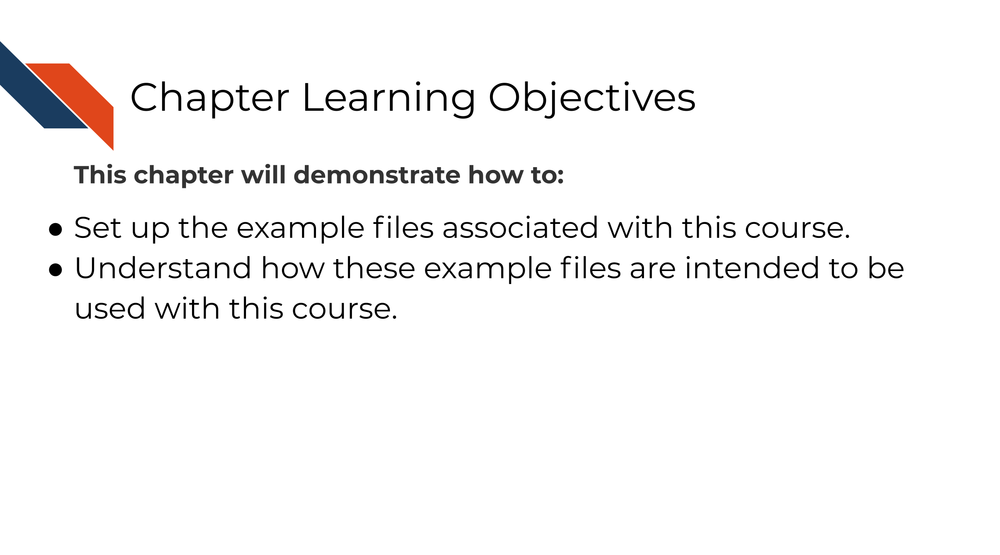

# How to use the example project files

Each chapter has a set of example project files for you to practice applying the reproducibility concepts we discuss.
These project files will start out as not very reproducible (they don't run properly) but at the end of the course your goal is to make them into a lovely project that creates a nice heatmap!

These files come in Python or R options depending on your preference your resulting heatmap should look like one of these:

This is the R version of the heatmap:


This is the Python version of the heatmap:


## How to download the chapter files

At the beginning of each chapter, we will prompt you to download either the R or Python project files and edit the files along with the course.

We will have the download commands typed out for you that you will copy and paste to your command line. If you have not used command line or are not sure how to find it, [read this article](https://towardsdatascience.com/a-quick-guide-to-using-command-line-terminal-96815b97b955).

#### Getting wget

All you will need to do is make sure you have `wget` installed on your computer. You can check if you have it by running the following in your command line:


```bash
wget -V
```

```
## GNU Wget 1.20.3 built on linux-gnu.
## 
## -cares +digest -gpgme +https +ipv6 +iri +large-file -metalink +nls 
## +ntlm +opie +psl +ssl/openssl 
## 
## Wgetrc: 
##     /etc/wgetrc (system)
## Locale: 
##     /usr/share/locale 
## Compile: 
##     gcc -DHAVE_CONFIG_H -DSYSTEM_WGETRC="/etc/wgetrc" 
##     -DLOCALEDIR="/usr/share/locale" -I. -I../../src -I../lib 
##     -I../../lib -Wdate-time -D_FORTIFY_SOURCE=2 -DHAVE_LIBSSL -DNDEBUG 
##     -g -O2 -fdebug-prefix-map=/build/wget-OYIfr9/wget-1.20.3=. 
##     -fstack-protector-strong -Wformat -Werror=format-security 
##     -DNO_SSLv2 -D_FILE_OFFSET_BITS=64 -g -Wall 
## Link: 
##     gcc -DHAVE_LIBSSL -DNDEBUG -g -O2 
##     -fdebug-prefix-map=/build/wget-OYIfr9/wget-1.20.3=. 
##     -fstack-protector-strong -Wformat -Werror=format-security 
##     -DNO_SSLv2 -D_FILE_OFFSET_BITS=64 -g -Wall -Wl,-Bsymbolic-functions 
##     -Wl,-z,relro -Wl,-z,now -lpcre2-8 -luuid -lidn2 -lssl -lcrypto -lz 
##     -lpsl ftp-opie.o openssl.o http-ntlm.o ../lib/libgnu.a 
## 
## Copyright (C) 2015 Free Software Foundation, Inc.
## License GPLv3+: GNU GPL version 3 or later
## <http://www.gnu.org/licenses/gpl.html>.
## This is free software: you are free to change and redistribute it.
## There is NO WARRANTY, to the extent permitted by law.
## 
## Originally written by Hrvoje Niksic <hniksic@xemacs.org>.
## Please send bug reports and questions to <bug-wget@gnu.org>.
```
If this prints back something similar to this message above, then you already have `wget` and don't need to do anything! But if this command prints back `wget command not found` you will need to [ install wget](https://www.jcchouinard.com/wget/). 

Happy coding!
