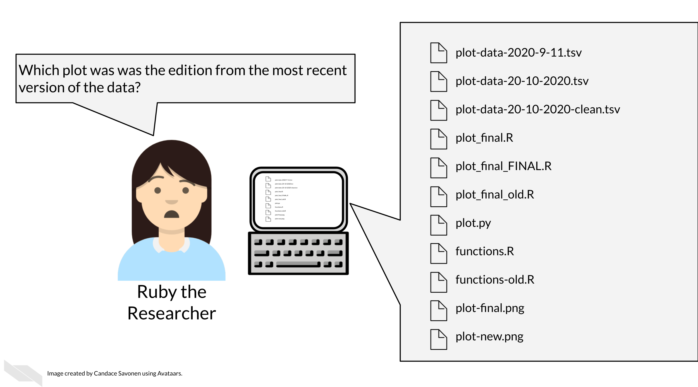

# Organizing your project

## Learning Objectives


Keeping your files organized is a skill that has a high long-term pay off.As you are in the thick of an analysis, you may underestimate how many files and terms you have floating around. But a short time later, you may return to your files and realize your organization was not as clear as you hoped.   



@Tayo2019 discusses four particular reasons why it is important to organize your project:

> 1. Organization increases productivity. If a project is well organized, with everything placed in one directory, it makes it easier to avoid wasting time searching for project files such as datasets, codes, output files, and so on.
> 2. A well-organized project helps you to keep and maintain a record of your ongoing and completed data science projects.
> 3. Completed data science projects could be used for building future models. If you have to solve a similar problem in the future, you can use the same code with slight modifications.
> 4. A well-organized project can easily be understood by other data science professionals when shared on platforms such as Github.

Organization is yet another aspect of reproducibility that saves you and your colleagues time!


## Organizational strategies

There's a lot of ways to keep your files organized, and there's not a "one size fits all" organizational solution [@Shapiro_Childhood_Cancer_Data_2021]. In this chapter, we will discuss some generalities but as far as specifics we will point you to others' who have written about works for them and advise that you use them as inspiration to figure out a strategy that works for you and your team.

The most important aspects of your project organization scheme is that it:  

- Is [project-oriented](https://www.tidyverse.org/blog/2017/12/workflow-vs-script/) [@Bryan2017].  
- Follows consistent patterns.  
- Is easy for you and others to find the files you need quickly.  
- Minimizes the likelihood for errors (like writing over files accidentally).  
[@Shapiro_Childhood_Cancer_Data_2021]


### Readings about organizational strategies for data science projects:

- [Jenny Bryan's organizational strategy](https://www.stat.ubc.ca/~jenny/STAT545A/block19_codeFormattingOrganization.html) [@Bryan2021].
- [Jenny Bryan on Project-oriented workflows](https://www.tidyverse.org/blog/2017/12/workflow-vs-script/)[@Bryan2017].
- [Data Carpentry mini course about organizing projects](https://datacarpentry.org/organization-genomics/) [@DataCarpentry2021].
https://bioinformaticsworkbook.org/projectManagement/Intro_projectManagement.html#gsc.tab=0
- [A BioStars thread where many individuals share their own organizational strategies](https://www.biostars.org/p/821/) [@Biostars2021].
- [Data Carpentry course chapter about getting organized](https://bioinformatics-core-shared-training.github.io/shell-genomics/07-organization/index.html) [@DataCarpentry2019].


### Exercise: Organize your project!

#### Get the example project files for this chapter

For this chapter, we will organize our example project files!

To get the _Python project example files_, copy and paste these commands below into your command line and press Enter.


```bash
mkdir -p chapter-zips
wget -O chapter-zips/python-heatmap-chapt-4.zip https://raw.githubusercontent.com/jhudsl/Reproducibility-Examples/main/chapter-zips/python-heatmap-chapt-4.zip
```

```
## --2021-10-14 13:23:20--  https://raw.githubusercontent.com/jhudsl/Reproducibility-Examples/main/chapter-zips/python-heatmap-chapt-4.zip
## Resolving raw.githubusercontent.com (raw.githubusercontent.com)... 185.199.111.133, 185.199.109.133, 185.199.108.133, ...
## Connecting to raw.githubusercontent.com (raw.githubusercontent.com)|185.199.111.133|:443... connected.
## HTTP request sent, awaiting response... 200 OK
## Length: 9847692 (9.4M) [application/zip]
## Saving to: ‘chapter-zips/python-heatmap-chapt-4.zip’
## 
##      0K .......... .......... .......... .......... ..........  0% 1.38M 7s
##     50K .......... .......... .......... .......... ..........  1% 1.63M 6s
##    100K .......... .......... .......... .......... ..........  1% 3.05M 5s
##    150K .......... .......... .......... .......... ..........  2% 2.94M 5s
##    200K .......... .......... .......... .......... ..........  2% 3.38M 4s
##    250K .......... .......... .......... .......... ..........  3% 3.59M 4s
##    300K .......... .......... .......... .......... ..........  3% 4.19M 4s
##    350K .......... .......... .......... .......... ..........  4% 3.80M 3s
##    400K .......... .......... .......... .......... ..........  4% 4.88M 3s
##    450K .......... .......... .......... .......... ..........  5% 5.37M 3s
##    500K .......... .......... .......... .......... ..........  5% 3.03M 3s
##    550K .......... .......... .......... .......... ..........  6% 3.15M 3s
##    600K .......... .......... .......... .......... ..........  6% 4.08M 3s
##    650K .......... .......... .......... .......... ..........  7% 4.87M 3s
##    700K .......... .......... .......... .......... ..........  7% 4.18M 3s
##    750K .......... .......... .......... .......... ..........  8% 3.91M 3s
##    800K .......... .......... .......... .......... ..........  8% 5.07M 3s
##    850K .......... .......... .......... .......... ..........  9% 4.77M 3s
##    900K .......... .......... .......... .......... ..........  9% 4.83M 3s
##    950K .......... .......... .......... .......... .......... 10% 4.07M 2s
##   1000K .......... .......... .......... .......... .......... 10% 4.50M 2s
##   1050K .......... .......... .......... .......... .......... 11% 3.81M 2s
##   1100K .......... .......... .......... .......... .......... 11% 3.04M 2s
##   1150K .......... .......... .......... .......... .......... 12% 2.88M 2s
##   1200K .......... .......... .......... .......... .......... 12% 3.32M 2s
##   1250K .......... .......... .......... .......... .......... 13% 3.57M 2s
##   1300K .......... .......... .......... .......... .......... 14% 4.62M 2s
##   1350K .......... .......... .......... .......... .......... 14% 3.23M 2s
##   1400K .......... .......... .......... .......... .......... 15% 4.11M 2s
##   1450K .......... .......... .......... .......... .......... 15% 4.86M 2s
##   1500K .......... .......... .......... .......... .......... 16% 5.39M 2s
##   1550K .......... .......... .......... .......... .......... 16% 4.33M 2s
##   1600K .......... .......... .......... .......... .......... 17% 5.24M 2s
##   1650K .......... .......... .......... .......... .......... 17% 5.52M 2s
##   1700K .......... .......... .......... .......... .......... 18% 5.28M 2s
##   1750K .......... .......... .......... .......... .......... 18% 4.54M 2s
##   1800K .......... .......... .......... .......... .......... 19% 6.24M 2s
##   1850K .......... .......... .......... .......... .......... 19% 6.68M 2s
##   1900K .......... .......... .......... .......... .......... 20% 6.20M 2s
##   1950K .......... .......... .......... .......... .......... 20% 4.40M 2s
##   2000K .......... .......... .......... .......... .......... 21% 4.98M 2s
##   2050K .......... .......... .......... .......... .......... 21% 5.22M 2s
##   2100K .......... .......... .......... .......... .......... 22% 5.01M 2s
##   2150K .......... .......... .......... .......... .......... 22% 4.63M 2s
##   2200K .......... .......... .......... .......... .......... 23% 4.92M 2s
##   2250K .......... .......... .......... .......... .......... 23% 4.60M 2s
##   2300K .......... .......... .......... .......... .......... 24% 5.32M 2s
##   2350K .......... .......... .......... .......... .......... 24% 4.60M 2s
##   2400K .......... .......... .......... .......... .......... 25% 4.44M 2s
##   2450K .......... .......... .......... .......... .......... 25% 4.88M 2s
##   2500K .......... .......... .......... .......... .......... 26% 5.06M 2s
##   2550K .......... .......... .......... .......... .......... 27% 5.04M 2s
##   2600K .......... .......... .......... .......... .......... 27% 4.92M 2s
##   2650K .......... .......... .......... .......... .......... 28% 5.43M 2s
##   2700K .......... .......... .......... .......... .......... 28% 5.52M 2s
##   2750K .......... .......... .......... .......... .......... 29% 5.01M 2s
##   2800K .......... .......... .......... .......... .......... 29% 5.23M 2s
##   2850K .......... .......... .......... .......... .......... 30% 5.53M 2s
##   2900K .......... .......... .......... .......... .......... 30% 5.56M 2s
##   2950K .......... .......... .......... .......... .......... 31% 4.68M 2s
##   3000K .......... .......... .......... .......... .......... 31% 5.40M 2s
##   3050K .......... .......... .......... .......... .......... 32% 5.71M 2s
##   3100K .......... .......... .......... .......... .......... 32% 5.80M 2s
##   3150K .......... .......... .......... .......... .......... 33% 4.74M 1s
##   3200K .......... .......... .......... .......... .......... 33% 5.69M 1s
##   3250K .......... .......... .......... .......... .......... 34% 5.62M 1s
##   3300K .......... .......... .......... .......... .......... 34% 4.93M 1s
##   3350K .......... .......... .......... .......... .......... 35% 4.43M 1s
##   3400K .......... .......... .......... .......... .......... 35% 5.26M 1s
##   3450K .......... .......... .......... .......... .......... 36% 4.82M 1s
##   3500K .......... .......... .......... .......... .......... 36% 5.13M 1s
##   3550K .......... .......... .......... .......... .......... 37% 4.70M 1s
##   3600K .......... .......... .......... .......... .......... 37% 5.58M 1s
##   3650K .......... .......... .......... .......... .......... 38% 5.25M 1s
##   3700K .......... .......... .......... .......... .......... 38% 5.71M 1s
##   3750K .......... .......... .......... .......... .......... 39% 4.41M 1s
##   3800K .......... .......... .......... .......... .......... 40% 5.64M 1s
##   3850K .......... .......... .......... .......... .......... 40% 4.98M 1s
##   3900K .......... .......... .......... .......... .......... 41% 4.89M 1s
##   3950K .......... .......... .......... .......... .......... 41% 4.09M 1s
##   4000K .......... .......... .......... .......... .......... 42% 4.53M 1s
##   4050K .......... .......... .......... .......... .......... 42% 5.07M 1s
##   4100K .......... .......... .......... .......... .......... 43% 4.96M 1s
##   4150K .......... .......... .......... .......... .......... 43% 4.22M 1s
##   4200K .......... .......... .......... .......... .......... 44% 4.74M 1s
##   4250K .......... .......... .......... .......... .......... 44% 4.90M 1s
##   4300K .......... .......... .......... .......... .......... 45% 5.10M 1s
##   4350K .......... .......... .......... .......... .......... 45% 4.79M 1s
##   4400K .......... .......... .......... .......... .......... 46% 5.90M 1s
##   4450K .......... .......... .......... .......... .......... 46% 3.96M 1s
##   4500K .......... .......... .......... .......... .......... 47% 3.53M 1s
##   4550K .......... .......... .......... .......... .......... 47% 4.98M 1s
##   4600K .......... .......... .......... .......... .......... 48% 5.76M 1s
##   4650K .......... .......... .......... .......... .......... 48% 5.60M 1s
##   4700K .......... .......... .......... .......... .......... 49% 5.35M 1s
##   4750K .......... .......... .......... .......... .......... 49% 4.42M 1s
##   4800K .......... .......... .......... .......... .......... 50% 6.40M 1s
##   4850K .......... .......... .......... .......... .......... 50% 4.91M 1s
##   4900K .......... .......... .......... .......... .......... 51% 5.58M 1s
##   4950K .......... .......... .......... .......... .......... 51% 3.72M 1s
##   5000K .......... .......... .......... .......... .......... 52% 4.68M 1s
##   5050K .......... .......... .......... .......... .......... 53% 5.34M 1s
##   5100K .......... .......... .......... .......... .......... 53% 5.25M 1s
##   5150K .......... .......... .......... .......... .......... 54% 4.11M 1s
##   5200K .......... .......... .......... .......... .......... 54% 4.78M 1s
##   5250K .......... .......... .......... .......... .......... 55% 4.77M 1s
##   5300K .......... .......... .......... .......... .......... 55% 4.66M 1s
##   5350K .......... .......... .......... .......... .......... 56% 3.84M 1s
##   5400K .......... .......... .......... .......... .......... 56% 4.98M 1s
##   5450K .......... .......... .......... .......... .......... 57% 4.98M 1s
##   5500K .......... .......... .......... .......... .......... 57% 3.67M 1s
##   5550K .......... .......... .......... .......... .......... 58% 4.14M 1s
##   5600K .......... .......... .......... .......... .......... 58% 5.26M 1s
##   5650K .......... .......... .......... .......... .......... 59% 4.74M 1s
##   5700K .......... .......... .......... .......... .......... 59% 5.39M 1s
##   5750K .......... .......... .......... .......... .......... 60% 4.22M 1s
##   5800K .......... .......... .......... .......... .......... 60% 4.99M 1s
##   5850K .......... .......... .......... .......... .......... 61% 5.12M 1s
##   5900K .......... .......... .......... .......... .......... 61% 4.96M 1s
##   5950K .......... .......... .......... .......... .......... 62% 4.64M 1s
##   6000K .......... .......... .......... .......... .......... 62% 4.70M 1s
##   6050K .......... .......... .......... .......... .......... 63% 4.33M 1s
##   6100K .......... .......... .......... .......... .......... 63% 3.83M 1s
##   6150K .......... .......... .......... .......... .......... 64% 4.05M 1s
##   6200K .......... .......... .......... .......... .......... 64% 4.63M 1s
##   6250K .......... .......... .......... .......... .......... 65% 4.90M 1s
##   6300K .......... .......... .......... .......... .......... 66% 4.08M 1s
##   6350K .......... .......... .......... .......... .......... 66% 3.31M 1s
##   6400K .......... .......... .......... .......... .......... 67% 4.32M 1s
##   6450K .......... .......... .......... .......... .......... 67% 6.25M 1s
##   6500K .......... .......... .......... .......... .......... 68% 4.63M 1s
##   6550K .......... .......... .......... .......... .......... 68% 3.69M 1s
##   6600K .......... .......... .......... .......... .......... 69% 4.32M 1s
##   6650K .......... .......... .......... .......... .......... 69% 4.46M 1s
##   6700K .......... .......... .......... .......... .......... 70% 5.12M 1s
##   6750K .......... .......... .......... .......... .......... 70% 3.34M 1s
##   6800K .......... .......... .......... .......... .......... 71% 4.64M 1s
##   6850K .......... .......... .......... .......... .......... 71% 4.94M 1s
##   6900K .......... .......... .......... .......... .......... 72% 5.36M 1s
##   6950K .......... .......... .......... .......... .......... 72% 4.76M 1s
##   7000K .......... .......... .......... .......... .......... 73% 5.22M 1s
##   7050K .......... .......... .......... .......... .......... 73% 3.75M 1s
##   7100K .......... .......... .......... .......... .......... 74% 3.54M 1s
##   7150K .......... .......... .......... .......... .......... 74% 3.00M 1s
##   7200K .......... .......... .......... .......... .......... 75% 4.34M 1s
##   7250K .......... .......... .......... .......... .......... 75% 4.24M 1s
##   7300K .......... .......... .......... .......... .......... 76% 4.03M 1s
##   7350K .......... .......... .......... .......... .......... 76% 3.93M 0s
##   7400K .......... .......... .......... .......... .......... 77% 4.31M 0s
##   7450K .......... .......... .......... .......... .......... 77% 4.74M 0s
##   7500K .......... .......... .......... .......... .......... 78% 4.24M 0s
##   7550K .......... .......... .......... .......... .......... 79% 4.24M 0s
##   7600K .......... .......... .......... .......... .......... 79% 3.62M 0s
##   7650K .......... .......... .......... .......... .......... 80% 3.14M 0s
##   7700K .......... .......... .......... .......... .......... 80% 3.85M 0s
##   7750K .......... .......... .......... .......... .......... 81% 3.08M 0s
##   7800K .......... .......... .......... .......... .......... 81% 4.08M 0s
##   7850K .......... .......... .......... .......... .......... 82% 3.50M 0s
##   7900K .......... .......... .......... .......... .......... 82% 3.66M 0s
##   7950K .......... .......... .......... .......... .......... 83% 3.09M 0s
##   8000K .......... .......... .......... .......... .......... 83% 4.53M 0s
##   8050K .......... .......... .......... .......... .......... 84% 4.99M 0s
##   8100K .......... .......... .......... .......... .......... 84% 5.42M 0s
##   8150K .......... .......... .......... .......... .......... 85% 4.73M 0s
##   8200K .......... .......... .......... .......... .......... 85% 4.84M 0s
##   8250K .......... .......... .......... .......... .......... 86% 4.95M 0s
##   8300K .......... .......... .......... .......... .......... 86% 5.47M 0s
##   8350K .......... .......... .......... .......... .......... 87% 4.21M 0s
##   8400K .......... .......... .......... .......... .......... 87% 3.37M 0s
##   8450K .......... .......... .......... .......... .......... 88% 3.56M 0s
##   8500K .......... .......... .......... .......... .......... 88% 3.87M 0s
##   8550K .......... .......... .......... .......... .......... 89% 3.85M 0s
##   8600K .......... .......... .......... .......... .......... 89% 4.62M 0s
##   8650K .......... .......... .......... .......... .......... 90% 3.34M 0s
##   8700K .......... .......... .......... .......... .......... 90% 5.22M 0s
##   8750K .......... .......... .......... .......... .......... 91% 3.67M 0s
##   8800K .......... .......... .......... .......... .......... 92% 4.98M 0s
##   8850K .......... .......... .......... .......... .......... 92% 4.41M 0s
##   8900K .......... .......... .......... .......... .......... 93% 4.87M 0s
##   8950K .......... .......... .......... .......... .......... 93% 5.06M 0s
##   9000K .......... .......... .......... .......... .......... 94% 5.41M 0s
##   9050K .......... .......... .......... .......... .......... 94% 5.50M 0s
##   9100K .......... .......... .......... .......... .......... 95% 5.12M 0s
##   9150K .......... .......... .......... .......... .......... 95% 5.04M 0s
##   9200K .......... .......... .......... .......... .......... 96% 4.69M 0s
##   9250K .......... .......... .......... .......... .......... 96% 4.74M 0s
##   9300K .......... .......... .......... .......... .......... 97% 5.64M 0s
##   9350K .......... .......... .......... .......... .......... 97% 4.38M 0s
##   9400K .......... .......... .......... .......... .......... 98% 3.44M 0s
##   9450K .......... .......... .......... .......... .......... 98% 3.48M 0s
##   9500K .......... .......... .......... .......... .......... 99% 3.78M 0s
##   9550K .......... .......... .......... .......... .......... 99% 3.67M 0s
##   9600K .......... ......                                     100% 5.16M=2.2s
## 
## 2021-10-14 13:23:22 (4.37 MB/s) - ‘chapter-zips/python-heatmap-chapt-4.zip’ saved [9847692/9847692]
```

To get the _R project examples files_ copy and paste these commands below into your command line and press Enter.


```bash
mkdir -p chapter-zips
wget -O chapter-zips/r-heatmap-chapt-4.zip https://raw.githubusercontent.com/jhudsl/Reproducibility-Examples/main/chapter-zips/r-heatmap-chapt-4.zip
```

```
## --2021-10-14 13:23:22--  https://raw.githubusercontent.com/jhudsl/Reproducibility-Examples/main/chapter-zips/r-heatmap-chapt-4.zip
## Resolving raw.githubusercontent.com (raw.githubusercontent.com)... 185.199.111.133, 185.199.109.133, 185.199.108.133, ...
## Connecting to raw.githubusercontent.com (raw.githubusercontent.com)|185.199.111.133|:443... connected.
## HTTP request sent, awaiting response... 200 OK
## Length: 2684806 (2.6M) [application/zip]
## Saving to: ‘chapter-zips/r-heatmap-chapt-4.zip’
## 
##      0K .......... .......... .......... .......... ..........  1% 1.51M 2s
##     50K .......... .......... .......... .......... ..........  3% 2.12M 1s
##    100K .......... .......... .......... .......... ..........  5% 2.87M 1s
##    150K .......... .......... .......... .......... ..........  7% 2.25M 1s
##    200K .......... .......... .......... .......... ..........  9% 3.29M 1s
##    250K .......... .......... .......... .......... .......... 11% 2.64M 1s
##    300K .......... .......... .......... .......... .......... 13% 2.89M 1s
##    350K .......... .......... .......... .......... .......... 15% 2.79M 1s
##    400K .......... .......... .......... .......... .......... 17% 3.65M 1s
##    450K .......... .......... .......... .......... .......... 19% 3.56M 1s
##    500K .......... .......... .......... .......... .......... 20% 3.38M 1s
##    550K .......... .......... .......... .......... .......... 22% 2.80M 1s
##    600K .......... .......... .......... .......... .......... 24% 3.27M 1s
##    650K .......... .......... .......... .......... .......... 26% 3.16M 1s
##    700K .......... .......... .......... .......... .......... 28% 3.53M 1s
##    750K .......... .......... .......... .......... .......... 30% 2.96M 1s
##    800K .......... .......... .......... .......... .......... 32% 3.76M 1s
##    850K .......... .......... .......... .......... .......... 34% 3.09M 1s
##    900K .......... .......... .......... .......... .......... 36% 3.70M 1s
##    950K .......... .......... .......... .......... .......... 38% 3.21M 1s
##   1000K .......... .......... .......... .......... .......... 40% 3.80M 1s
##   1050K .......... .......... .......... .......... .......... 41% 3.54M 1s
##   1100K .......... .......... .......... .......... .......... 43% 4.77M 0s
##   1150K .......... .......... .......... .......... .......... 45% 4.80M 0s
##   1200K .......... .......... .......... .......... .......... 47% 2.96M 0s
##   1250K .......... .......... .......... .......... .......... 49% 3.28M 0s
##   1300K .......... .......... .......... .......... .......... 51% 3.19M 0s
##   1350K .......... .......... .......... .......... .......... 53% 3.33M 0s
##   1400K .......... .......... .......... .......... .......... 55% 3.67M 0s
##   1450K .......... .......... .......... .......... .......... 57% 4.06M 0s
##   1500K .......... .......... .......... .......... .......... 59% 3.97M 0s
##   1550K .......... .......... .......... .......... .......... 61% 3.94M 0s
##   1600K .......... .......... .......... .......... .......... 62% 4.27M 0s
##   1650K .......... .......... .......... .......... .......... 64% 3.67M 0s
##   1700K .......... .......... .......... .......... .......... 66% 3.19M 0s
##   1750K .......... .......... .......... .......... .......... 68% 4.25M 0s
##   1800K .......... .......... .......... .......... .......... 70% 4.55M 0s
##   1850K .......... .......... .......... .......... .......... 72% 3.74M 0s
##   1900K .......... .......... .......... .......... .......... 74% 5.01M 0s
##   1950K .......... .......... .......... .......... .......... 76% 4.78M 0s
##   2000K .......... .......... .......... .......... .......... 78% 4.39M 0s
##   2050K .......... .......... .......... .......... .......... 80% 5.39M 0s
##   2100K .......... .......... .......... .......... .......... 82% 5.56M 0s
##   2150K .......... .......... .......... .......... .......... 83% 5.33M 0s
##   2200K .......... .......... .......... .......... .......... 85% 4.97M 0s
##   2250K .......... .......... .......... .......... .......... 87% 5.61M 0s
##   2300K .......... .......... .......... .......... .......... 89% 6.09M 0s
##   2350K .......... .......... .......... .......... .......... 91% 4.78M 0s
##   2400K .......... .......... .......... .......... .......... 93% 6.36M 0s
##   2450K .......... .......... .......... .......... .......... 95% 6.07M 0s
##   2500K .......... .......... .......... .......... .......... 97% 5.00M 0s
##   2550K .......... .......... .......... .......... .......... 99% 5.18M 0s
##   2600K .......... .......... .                               100% 5.24M=0.7s
## 
## 2021-10-14 13:23:23 (3.63 MB/s) - ‘chapter-zips/r-heatmap-chapt-4.zip’ saved [2684806/2684806]
```

Now double click your chapter zip file to unzip.
