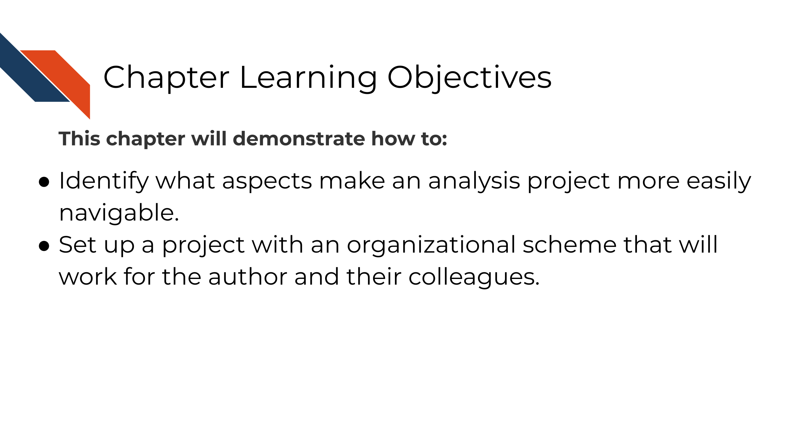

# Organizing your project

## Learning Objectives

## Get the exercise project files (or continue with the files you used in the previous chapter)

 
How to get the _Python project example files_

To get the _Python project example files_, [click this link](https://raw.githubusercontent.com/jhudsl/Reproducibility_in_Cancer_Informatics/main/chapter-zips/python-heatmap-chapt-7.zip).

Now double click your chapter zip file to unzip. For Windows you may have to [follow these instructions](https://support.microsoft.com/en-us/windows/zip-and-unzip-files-f6dde0a7-0fec-8294-e1d3-703ed85e7ebc)).

 
How to get the _R project example files_

To get the _R project example files_, [click this link](https://raw.githubusercontent.com/jhudsl/Reproducibility_in_Cancer_Informatics/main/chapter-zips/r-heatmap-chapt-7.zip).

Now double click your chapter zip file to unzip. For Windows you may have to [follow these instructions](https://support.microsoft.com/en-us/windows/zip-and-unzip-files-f6dde0a7-0fec-8294-e1d3-703ed85e7ebc)).

## Exercise: Make code more durable!
