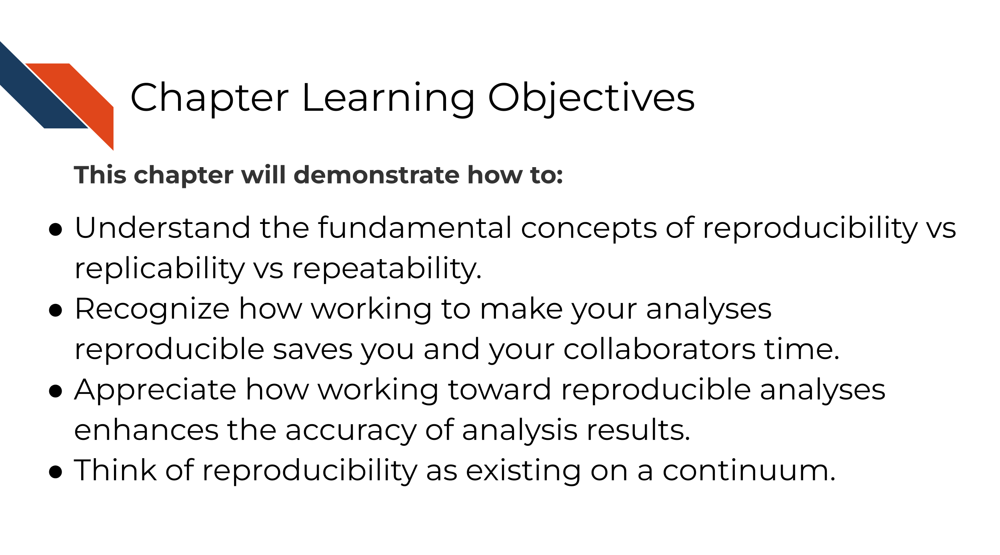
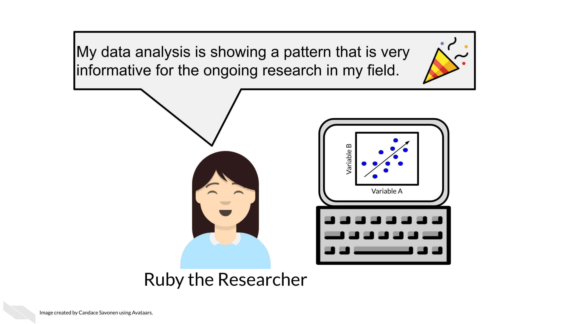
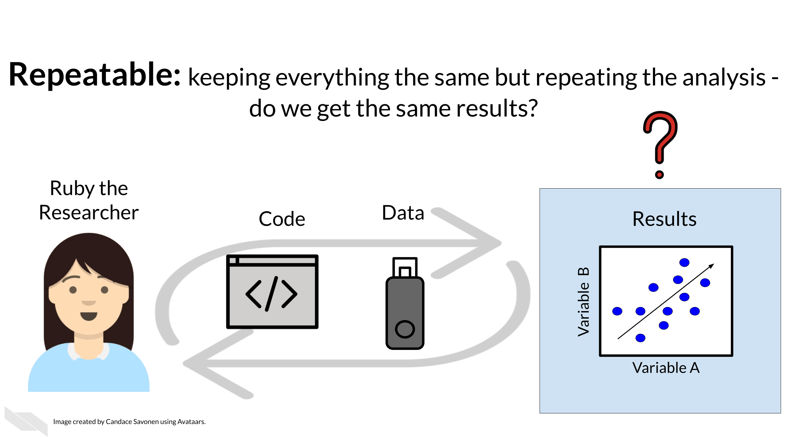
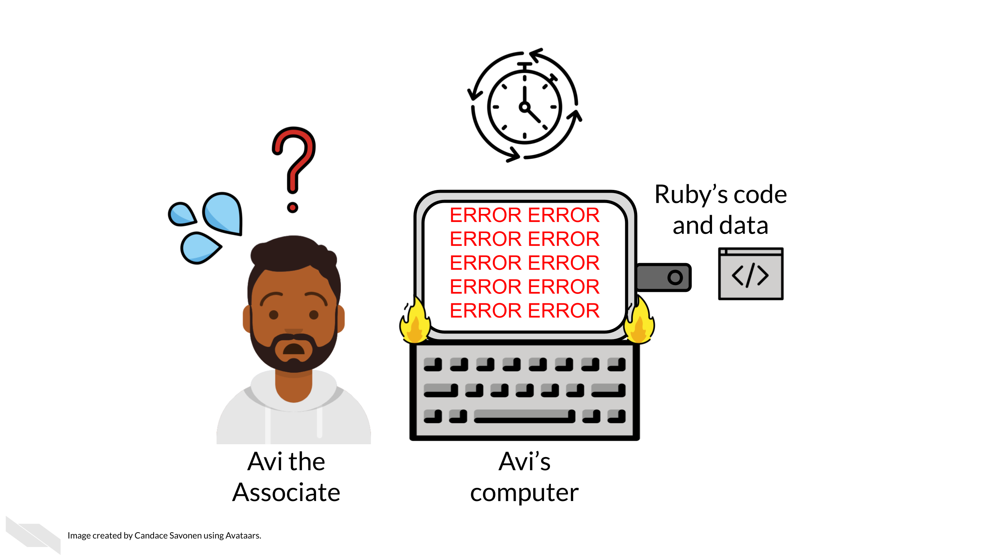
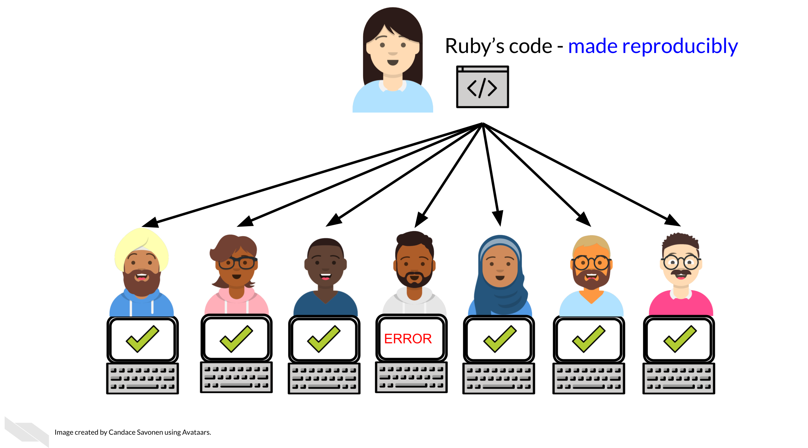

# Defining reproducibility

## Learning Objectives

## What is reproducibility

There's been a lot of discussion about what is included in the term `reproducibility` and there is some discrepancy between fields. For the purposes of informatics and data analysis, a _reproducible analysis is one that can be re-run by a different researcher and the same result and conclusion is found_.

Reproducibility is related to repeatability and replicability but it is worth taking time to differentiate these terms.

Perhaps you are like Ruby and have just found an interesting pattern through your data analysis! This has probably been the result of many months or years on your project and it's worth celebrating!

But before she considers these results a done deal, Ruby should test whether she is able to re-run her own analysis and get the same results again. This is known as _repeatability_.

Given that Ruby's analysis is repeatable; she may feel confident now to share her preliminary results with her colleague, Avi the Associate. Whether or not someone else will be able to take Ruby's code and data, re-run the analysis and obtain the same results is known as _reproducibility_.

If Ruby's results can be reproduced by Avi, now Avi may collect new data and use Ruby's same analysis methods to analyze his data. Whether or not Avi's new data and results concur with Ruby's study's original inferences is known as _replicability_.

You may realize that these levels of research build on each other (like science is supposed to do). In this way, we can think of them in a hierarchy.  Skipping any of these levels of research applicability can lead to unreliable results and conclusions.

Science progresses when data and hypotheses are put through these levels thoroughly and sequentially. If results are not repeatable, they won't be reproducible or replicable. If they are not reproducible, they won't be replicable.

Ideally all analyses and results would be reproducible without too much time and effort spent; this would aid in the efficiency of research getting to the next stages and questions. But unfortunately, in practice, reproducibility is not as commonplace as we would hope. Institutions and reward systems generally do not prioritize or even measure reproducibility in research, and training opportunities for reproducible techniques can be scarce. Reproducible research can often feel like an uphill battle that is made steeper by lack of training opportunities.

In this course, we hope to equip your research with the tools you need to enhance the reproducibility of your analyses so this uphill battle is _less steep_.

## Reproducibility in daily life

What does reproducibility mean in the daily life of a researcher?

Let's say Ruby's results are repeatable in her own hands and she excitedly tells her associate, Avi, about her preliminary findings. Avi is very excited about these results as well as Ruby's methods!

Ruby sends Avi the code and data she used to obtain the results. Now, whether or not Avi is able to obtain the same exact results with this same data and same analysis code will indicate if Ruby's analysis is reproducible.

Ruby may have spent a lot of time on her code and getting it to work on her computer, but whether it will successfully run on Avi's computer is another story. Often when researchers share their analysis code it leads to a substantial amount of effort on the part of the researcher who has received the code to get it working and this often cannot be done successfully without help from the original code author [@BeaulieuJones2017].

Avi is encountering errors because Ruby's code was written with Ruby's computer and local setup in mind and she didn't know how to make it more generally usable. Avi is spending a lot of time just trying to re-run Ruby's same analysis on her same data; he has yet to be able to try the code on any additional data (which may bring up even more errors).

Avi is still struggling to work with Ruby's code and is confused about the goals and approaches the code is taking. After struggling with Ruby's code for an untold amount of time, Avi may decide it's time to email Ruby to get some clarity. Now both Avi and Ruby are confused about why this analysis isn't nicely re-running for Avi. Their attempts to communicate about the code through email haven't helped them clarify anything. Multiple versions of the code may have been sent back and forth between them and now things are taking a lot more time than either of them expected.

Perhaps at some point Avi is able to successfully run Ruby's code on Ruby's same data. Just because Avi didn't get any errors doesn't mean that the code ran exactly the same as it did for Ruby.

Lack of errors also doesn't mean that either Ruby or Avi's runs of the code ran with high accuracy or that the results can be trusted. Even a small difference in decimal point may indicate a more fundamental difference in how the analysis was performed and this could be due to differences in software versions, settings, or any number of items in their computing environments.

## Reproducibility is worth the effort!

Perhaps you've found yourself in a situation like Ruby and Avi; struggling to re-run code that you thought for sure was working a minute ago. In the upcoming chapters, we will discuss how to bolster your projects' reproducibility.

As you apply these reproducible techniques to your own projects, you may feel like it is taking more time to reach endpoints, but keep in mind that reproducible analyses and projects have higher upfront costs but will absolutely pay off in the long term.

Reproducibility in your analyses is not only a time saver for yourself, but also your colleagues, your field, and your future self!

You might not change a single character in your code but then return to it in a few days/months/years and find that it no longer runs! Reproducible code stands the test of time longer, making 'future you' glad you spent the time to work on it. It's said that your closest collaborator is you from 6 months ago but you don't reply to email [@Broman].

Many a data scientist has referred to their frustration with their past selves:

<blockquote class="twitter-tweet">
Dear past-Hadley: PLEASE COMMENT YOUR CODE BETTER. Love present-Hadley
&mdash; Hadley Wickham (\@hadleywickham) <a href="https://twitter.com/hadleywickham/status/718203628528349184?ref_src=twsrc%5Etfw">April 7, 2016</a></blockquote> 

The more you comment your code, and make it clear and readable, the more your future self will thank you.

Reproducible code also saves your colleagues time! The more reproducible your code is, the less time all of your collaborators will need to spend troubleshooting it. The more people who use your code and need to try to fix it, the more time is wasted. This can add up to a lot of wasted researcher time and effort.

But, reproducible code saves everyone exponential amounts of time and effort! It will also motivate individuals to use and cite your code and analyses in the future!

## Reproducibility exists on a continuum!

Incremental work on your analyses is good! You do not need to make your analyses perfect on the first try or even within a particular time frame. The first step in creating an analysis is to get it to work once! But the work does not end there. Furthermore, no analysis is or will ever be perfect in that it will not be reproducible in every single context throughout time. Incrementally pushing our analyses toward the right of this continuum is the goal.

